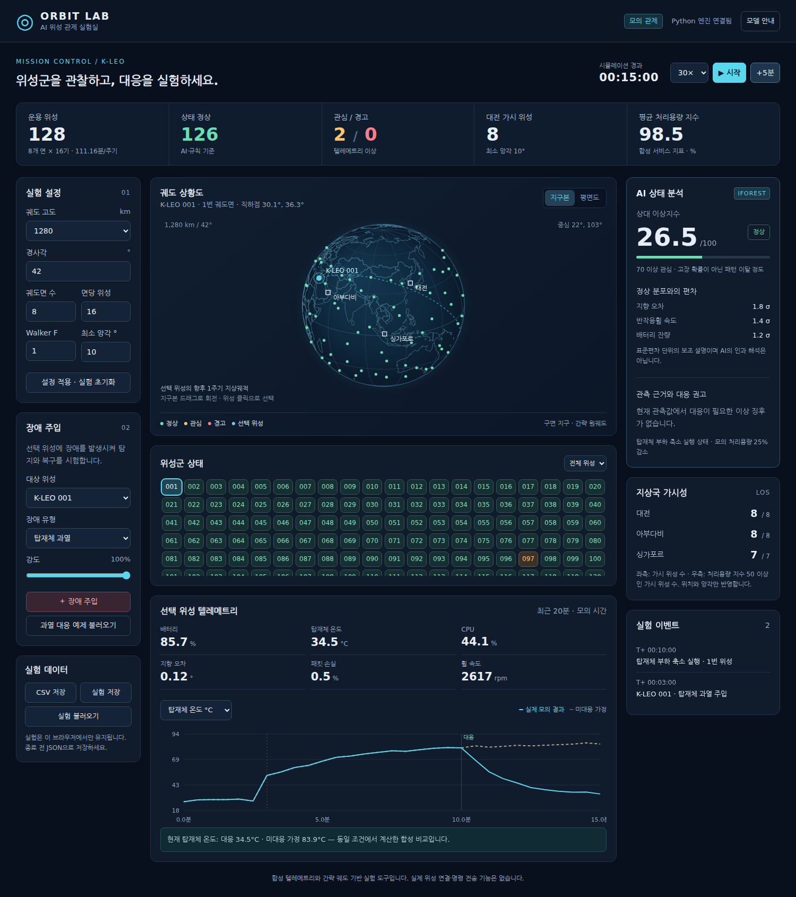

# AI 위성 관제 실험실 · ORBIT LAB

Python으로 동작하는 위성군 모의 관제 도구입니다. 위성 위치와 상태를 확인하고, 장애를 주입한 뒤 AI 이상 탐지와 모의 대응 결과를 비교합니다. **Render에 올릴 수 있는 전체 소스**이며 외부 AI API 키 없이 실행됩니다.



## 1. Render에 올리기

1. ZIP을 풀고 `ai-satellite-lab` 폴더 **안의 파일들**을 GitHub의 새 저장소에 업로드합니다. 저장소 최상단에 `main.py`, `requirements.txt`, `render.yaml`, `.python-version`, `static/`이 있어야 합니다. 압축파일 자체를 올리면 실행되지 않습니다.
2. Render 대시보드에서 **New → Blueprint**를 선택하고 위 GitHub 저장소를 연결합니다.
3. `render.yaml`의 설정을 확인하고 배포합니다. 기본은 무료 웹 서비스, Singapore 리전입니다.
4. 배포 완료 후 Render가 발급한 `https://….onrender.com` 주소를 엽니다.

Blueprint 대신 **New → Web Service**로 만들 경우:

| 항목 | 값 |
|---|---|
| Language / Runtime | Python 3 |
| Root Directory | 소스를 저장소 최상단에 올렸다면 비움 |
| Build Command | `pip install -r requirements.txt` |
| Start Command | `python -m uvicorn main:app --host 0.0.0.0 --port $PORT --workers 1` |
| Health Check Path | `/healthz` |
| Python | 포함된 `.python-version` 파일의 `3.12` |
| Instance Type | Free로 시작 가능 |

저장소 안에 폴더째 넣었다면 Web Service의 Root Directory를 `ai-satellite-lab`으로 설정하세요. Blueprint를 쓰려면 `render.yaml`을 저장소 최상단에 두고 소스 위치에 맞게 조정해야 하므로, 처음에는 파일들을 최상단에 올리는 방법을 권장합니다.

Render 환경변수에 기존 `PYTHON_VERSION`이 있으면 `.python-version`보다 우선합니다. 이 프로젝트의 기준은 Python 3.12입니다. Blueprint에는 계산 라이브러리의 과도한 스레드 생성을 피하도록 `OMP_NUM_THREADS=1`, `OPENBLAS_NUM_THREADS=1`을 넣었습니다.

무료 Render 서비스는 유휴 상태에서 중지될 수 있어 첫 접속이 지연될 수 있습니다. 파일시스템과 메모리를 영구 저장소로 사용하지 않습니다. 본 앱은 서버에 실험별 상태를 보관하지 않고, 브라우저가 요청마다 실험 설정을 전달합니다. 새로고침·탭 종료 전에는 **실험 저장**을 누르세요. 유료 플랜은 필요할 때 사용자가 선택할 수 있습니다.

공식 문서: [FastAPI 배포](https://render.com/docs/deploy-fastapi), [Blueprint 설정](https://render.com/docs/blueprint-spec), [Python 버전 지정](https://render.com/docs/python-version), [무료 서비스 조건](https://render.com/docs/free).

**이 패키지는 로컬에서 검증한 배포용 소스입니다. 사용자의 Render 계정에 실제 배포한 상태는 아닙니다.**

## 2. 내 PC에서 실행

Python 3.12를 설치합니다. Windows에서는 `start.bat`를 실행하면 가상환경과 의존성을 준비하고 서버를 시작합니다. 처음에는 패키지 다운로드를 위한 인터넷 연결이 필요합니다.

직접 실행하는 경우:

```bash
python -m venv .venv
```

Windows PowerShell:

```powershell
.venv\Scripts\python.exe -m pip install -r requirements.txt
.venv\Scripts\python.exe -m uvicorn main:app --host 127.0.0.1 --port 8000
```

macOS / Linux:

```bash
.venv/bin/python -m pip install -r requirements.txt
.venv/bin/python -m uvicorn main:app --host 127.0.0.1 --port 8000
```

브라우저에서 `http://localhost:8000`을 엽니다. 정적 지도와 차트 코드를 함께 제공하므로 실행 후 CDN·외부 지도 API·외부 AI 호출이 필요하지 않습니다.

## 3. 1분 체험

1. **과열 대응 예제 불러오기**를 누릅니다. 모의 시간 3분에 과열이 발생해 10분이 된 상태입니다.
2. AI 분석 패널에서 이상 징후와 관측 근거를 확인합니다.
3. **모의 실행 · 탑재체 부하 축소**를 누릅니다.
4. **+5분**을 눌러 온도와 이상지수의 변화를 봅니다.
5. 텔레메트리 그래프의 청록색 선과 ‘미대응 가정’ 점선을 비교합니다.
6. 처리용량 지표로 전환하여 부하 축소의 서비스 비용도 살펴봅니다.

실험 예제 버튼과 설정 적용 버튼은 현재 실험을 초기화합니다. 보관하려면 먼저 JSON으로 저장하세요.

## 4. 포함 기능

| 기능 | 구현 범위 |
|---|---|
| 위성군 설계 | 고도 500·888·1,280 km 선택, 경사각, 궤도면·면당 위성 수, Walker F, 최소 앙각 |
| 처리 범위 | 최대 512기, 궤도면 최대 32개, 모의 시간 최대 24시간 |
| 궤도 시각화 | 회전 가능한 지구본, 평면 지도, 위성 직하점, 선택 위성의 향후 한 주기 지상궤적 |
| 가시성 | 대전·아부다비·싱가포르 지상국 위치와 최소 앙각에 따른 위성 수 |
| 텔레메트리 | 배터리·탑재체 온도·CPU·지향 오차·패킷 손실·휠 속도 |
| AI | Isolation Forest로 정상 패턴 이탈 탐지 + 임계값 기반 경고·대응 권고 |
| 장애 | 배터리 저하, 과열, 자세 불안정, 통신 품질 저하, 컴퓨터 과부하 |
| 모의 대응 | 절전, 탑재체 부하 축소, 자세제어 재초기화, 예비 통신계 전환, 컴퓨터 재시작 |
| 비교 | 동일 시각·동일 난수 조건의 대응 실행 / 미대응 결과 비교 |
| 재현성 | 시드·설정·장애·대응 시각을 JSON 저장 및 복원 |
| 데이터 | 현재 시각 전체 위성 CSV, Excel 호환 UTF-8 BOM 포함 |

초기 예시: **1,280 km / 42° / 8개 면 × 16기 / F=1 / 최소 앙각 10°**. 이는 편집 가능한 실험 기본값이며 정부 확정 설계나 최적 배치 결과를 의미하지 않습니다. F는 궤도면 수보다 작아야 합니다. 1개 궤도면에서는 F=0을 사용합니다.

재생 속도 30×는 화면 갱신당 모의 30초 진행입니다. 네트워크·계산 대기시간은 추가되므로 엄밀한 실제 시간 배율은 아닙니다. 탭이 숨겨지면 일시정지합니다.

## 5. AI와 계산 모델

### 궤도

`engine.geometry()`는 Walker Delta T/P/F의 원궤도 위치를 벡터화해 계산합니다. RAAN 간격은 360/P°, 같은 면의 위성 간격은 360/S°, 인접 면의 위상차는 F×360/T°입니다. 케플러 원궤도 주기와 단순 지구 자전으로 ECEF 위치를 계산합니다. 지상국은 구면 지구 표면의 고정 지점입니다.

TLE/SGP4, J2 섭동, 지구 타원체, 실제 UTC 기준의 지구 자세, 대기저항, 일식, 태양방향·발전량, 광 ISL, 핸드오버·링크버짓은 포함하지 않습니다. 지도는 Natural Earth 저해상도 자료이며 위성 점은 직하점을 나타냅니다. 임무 설계 검증이나 실제 운용 예측에는 고정밀 궤도·환경 모델을 별도로 연결해야 합니다.

### 이상 탐지

정상 위성의 6개 지표를 합성한 표본 **6,000개**로 Isolation Forest를 한 번 학습합니다. 별도 정상 표본 4,000개의 점수 분포로 0~100 상대 이상지수를 보정합니다. 모델에는 주입 장애 종류나 정답 라벨을 전달하지 않습니다. 학습 모델·시뮬레이션 난수는 고정 시드로 재현합니다.

Isolation Forest가 반환하는 점수의 의미는 [scikit-learn 공식 문서](https://scikit-learn.org/stable/modules/generated/sklearn.ensemble.IsolationForest.html)를 참고하세요. 이 앱의 0~100 변환은 별도의 사용자 정의 지수입니다. **고장 확률, 분류 정확도, 실제 비행 데이터로 검증된 신뢰도가 아닙니다.**

단일 지표의 큰 변화에 AI 점수가 충분히 반응하지 않을 수 있으므로 임계값 규칙을 함께 적용합니다. 따라서 **AI 지수가 70 미만이어도 상태가 경고일 수 있습니다.** 정상 분포에서도 일부 관심 알림이 발생하며 이를 숨기지 않습니다. 화면의 σ 편차는 전체 정상 분포에 대한 보조 설명이며 SHAP·인과 분석이 아닙니다.

| 관측값 | 관심 기준 | 경고 기준 |
|---|---|---|
| 배터리 잔량 | 55% 미만 | 25% 미만 |
| 탑재체 온도 | 48°C 초과 | 70°C 초과 |
| 지향 오차 | 0.30° 초과 | 1.0° 초과 |
| 패킷 손실 | 4% 초과 | 20% 초과 |
| CPU 사용률 | 75% 초과 | 95% 초과 |
| AI 이상지수 | 70 이상 | 단독 경고 기준 없음 |

위 기준은 교육·실험을 위한 예시입니다. 실제 제품의 요구조건을 나타내지 않습니다. 권고 생성은 관측값 규칙이며 LLM이 작성하는 분석이 아닙니다.

### 장애와 대응

장애는 주입 시점에 설정 강도의 45%로 시작하고 160초 시정수로 증가합니다. 적합한 대응을 실행하면 해당 장애 영향은 90초 시정수로 감소해 원래 영향의 1%로 접근합니다. 실제 하드웨어의 배터리 충전·열방정식·제어 응답을 모델링한 것이 아닙니다. 대응 중에도 같은 정상 노이즈가 적용됩니다.

처리용량 지수는 정상 값을 100으로 두고 패킷 손실·심각한 상태·대응 비용을 반영한 합성 지표입니다. 절전은 ×0.65, 부하 축소는 ×0.75, 예비 통신계 전환은 ×0.90을 적용합니다. 자세 재초기화는 60초, 컴퓨터 재시작은 90초 동안 중단합니다. 여러 대응 비용은 곱해집니다. 모의 서비스 지표는 실제 용량(Gbps), 링크 가용도, 망 서비스 가용도와 다릅니다.

그래프는 최근 최대 20분을 30초 간격으로 재계산합니다. 대응 가정 비교에는 모든 모의 대응을 제거한 동일 위성·동일 시간의 결과를 사용합니다. CSV는 현재 순간의 전체 위성 스냅샷이며 장기 시계열 전체를 담지 않습니다. JSON에는 시계열 재현에 필요한 입력값이 들어갑니다.

## 6. 소스 구조

| 파일 | 역할 |
|---|---|
| `main.py` | FastAPI 엔드포인트, 입력 검증, CSV 다운로드, 정적 파일 제공 |
| `engine.py` | Python 궤도·텔레메트리·이상 탐지·대응 계산 |
| `static/index.html` | 한국어 관제 화면 |
| `static/style.css` | 데스크톱·모바일 반응형 스타일 |
| `static/app.js` | API 호출, 지도·그래프, 입력·재생·내보내기 |
| `static/world.json` | 번들 지도 좌표 |
| `render.yaml` | Render Blueprint |
| `.python-version` | Render Python 버전 |
| `start.bat` | Windows 실행 도우미 |
| `tests/test_lab.py` | 핵심 계산·API·CSV·재현성 테스트 |

궤도·AI·상태 계산은 Python이며 브라우저 화면에는 HTML/CSS/JavaScript를 사용합니다. 서버는 파일 업로드·사용자 계정·데이터베이스·실제 위성 통신 기능을 제공하지 않습니다. JSON 불러오기는 브라우저에서 읽어 검증된 수치 입력으로 전송합니다. 서버는 요청 간 사용자 상태를 공유하지 않습니다.

## 7. 개발 및 검증

```bash
python -m pip install -r requirements-dev.txt
python -m pytest -q
```

API 명세는 `/openapi.json`에서 확인할 수 있습니다. 관제 화면은 외부 CDN 없이 동작합니다.

건강 확인: `GET /healthz`. 모의 계산: `POST /api/simulate`. CSV: `POST /api/export`. 장애·대응 목록: `GET /api/catalog`.

자동 검증은 원궤도 해석해, 3개 고도 × 3개 위성군 크기의 CSV 일치, 5종 장애 탐지와 대응, 입력 제한, 세션 간 독립성, 재시작 비용, 재현성을 포함합니다. 검증 범위와 결과는 `VALIDATION.md`에 기록했습니다.

다음 단계에서는 `telemetry()`를 실제 시뮬레이터 또는 익명화된 비행 데이터 어댑터로 교체하고, 정상 운용모드별 모델·검증 데이터 분리·오탐/미탐 평가·이벤트 영구 저장을 추가할 수 있습니다. 현재 패키지는 실험 도구로 완결되어 있으며 실제 관제망 연결을 전제로 하지 않습니다.

## 지도 출처

`static/world.json`: Natural Earth 1:110m, GeoPandas 0.14.4 배포본의 `naturalearth_lowres` 좌표에서 변환. [Natural Earth 이용 조건](https://www.naturalearthdata.com/about/terms-of-use/)에 따른 public domain 데이터입니다. GeoPandas·pyshp는 지도 변환에만 사용했으며 앱 실행 의존성에 포함되지 않습니다.
